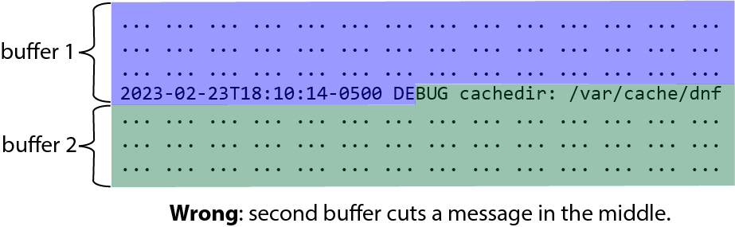
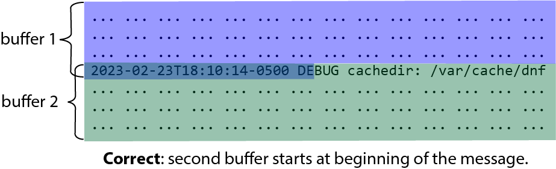

# Compressed log processing (CLP) parsing library
This library parses raw log messages and extracts information specified by
a user schema file or CLP's heuristics.
It takes in a byte buffer of raw logs, IO function pointers, or a log file, and
returns a list of objects, where each object represents a parsed log message.

## Motivating example
Given a log message to parse:
```
2023-02-23T18:10:14-0500 DEBUG task_123 crashed. Dumping stacktrace:
#0  0x000000000040110e in bar () at example.cpp:6
#1  0x000000000040111d in foo () at example.cpp:10
#2  0x0000000000401129 in main () at example.cpp:15
```
Using this schema, `sample_schema_file.txt`:
```
timestamp:\d{4}\-\d{2}\-\d{2}T\d{2}:\d{2}:\d{2}\-\d{4}
verbosity:INFO|DEBUG|WARN|ERROR
task_id:task_\d+
frame_location:[0-9A-Za-z_-.]+:\d+
```
Parsing and inspecting the log:
```cpp
auto parser = BufferParserFromFile("sample_schema_file.txt");
char buf[4096];
fill_buffer(&buf); // assume the buffer contains the above log
size_t read_to;
LogView logview;
parser->getNextLogView(buf, 4096, read_to, logview);
if (logview->isMultiLine()) { // True
    std::cout << logview->getVerbosity() << std::endl; // "DEBUG"
    std::cout << logview->getVarByName("task_id", 0) << std::endl; // "task_123"
    std::cout << logview->getVarByName("frame_location", 0) << std::endl; // "example.cpp:6"
    std::cout << logview->getVarByName("frame_location", 2) << std::endl; // "example.cpp:15"
}
```

## API styles
This library has three API styles to parse logs:
* The *buffer* parser requires the user to perform all reading operations and the
  parser will extract logs from the provided byte buffer.
* The *reader* parser allows the parser to perform all reading operations by
  calling user provided functions, abstracting the IO source.
* The *file* parser takes a file name and performs all management of the file
  internally.

### BufferParser
The byte buffer style is more flexible for the user, letting them control all
IO operations for the logs. This creates challenges:
* The user must handle edge cases themselves. Specifically, they need to ensure
  a buffer starts at the beginning of a message. For example, consider the
  following example:

* The two non-overlapping buffers split at the middle of a message. If we use
  the library to parse the two buffers one after another, that message will not
  be correctly parsed. The correct way of using the log parsing library is
  shown as below:

* In this case, the second buffer starts at the beginning of the log message,
  which means it overlaps with the first buffer. The user would know the
  location of the start of the message from the `read_to` return value when
  parsing the first buffer, which tells the location of the end of the last
  completely-parsed log message of the buffer. 
* The code example below on Buffer parser shows one way to correctly use a
  buffer.
* Note that the library detects the end of a log by finding the start of the
  next log, i.e., the next timestamp (or the end of the buffer if the `end`
  parameter is true). This means that even if the first buffer ends at the
  boundary of a log message, the library will not parse the last message in the
  buffer (`read_to` will point to the end of the second-to-last log) unless the
  `end` parameter is true.
* For good performance, the user must perform efficient IO with minimal copying.
* The above points lead to the user writing and maintaining more code in general.

### FileParser
The `FileParser` is a convenience API for the parsing of files. It takes the
path to a file, and will perform all IO operations on its own.

### ReaderParser
A `Reader` allows for the CLP parsing logic to handling all IO. This simplifies
user code and ensures efficient IO use by the parser.
This requires the user to define to functions:
* `read`: A typical read function that takes a destination byte buffer and size
  to read. The parser will call this function using its internal buffer as the
  destination.
* `done`: A function to signify that the end of the source input has been
  reached (for example, returning whether a file stream is at EOF).

This interface is simple, but extendable.
* For example, if the user does not want read to block indefinitely, they can
  include timeout logic inside their provided function (for example, in the
  case of a blocking socket).

## LogView and Log
The relationship of `LogView` and `Log` is analogous to `std::string_view` and
`std::string`.
* A `Log` object *owns* the underlying bytes necessary to express any
  information about the log. Any `string_view` returned by its methods will
  reference the `Log`'s internal data.
* A `LogView` object has weak references to the byte buffer used during parsing
  to construct it. Any `string_view` returned by its methods will reference
  this source buffer's data.
  * A `LogView` can create a `Log` by using `LogView::DeepCopy()` or
    a `Log` constructor.

### Advantages of LogView
In CLP the returned log message variables from the parser reference the
internal buffer. CLP will use the variables for compression before continuing
parsing. Continuing parsing will overwrite the buffer with more raw logs. This
will invalidate the references to earlier logs. Since CLP has finished
compression, invalidating these references is safe.
CLP benefits by using `LogView`s because it can avoid copying the data
of any log out of the parsing buffer.

### LogView lifetime
A `LogView` remains valid if the lifetime of the parsing buffer it references
has not ended and the buffer is not mutated.
* `BufferParser`: The user must ensure the buffer used to produce a `LogView`
  they use still contains the correct references.
* `ReaderParser` and `FileParser`: A `LogView` is safe to use until the next
  `*Parser::get*` invocation.

# Code examples
These examples parse log messages from a source, `STREAM`, filters for logs
with the `ERROR` verbosity level, and writes them into a vector.

## BufferParser
```cpp
#include <cstdio>
// std::size_t fread(void *buffer, std::size_t size, std::size_t count, std::FILE *stream);
// int feof(std::FILE *stream);
// assume we have an open FILE named STREAM

std::optional<BufferParser> parser;
if (!(parser = BufferParserFromFile("heuristic_schema_file.txt");)) {
    // error building parser
}

size_t const SIZE = 4096;
std::vector error_logs;
char buf[SIZE];
size_t valid_size = fread(buf, sizeof(char), SIZE, STREAM);
while (!feof(STREAM)) {
    size_t read_to;
    LogView logview;
    if (0 != parser->getNextLogView(buf, size, read_to, logview)) {
        break;
    }

    // filter using view to avoid needless copying
    if ("ERROR" == logview->getVerbosity()) {
        // only perform copying on logs we actually care about
        error_logs.emplace_back(logview->deepCopy());
    }

    // must do buffer manipulation after using the log view
    // note this logic is simplified and does not handle all cases
    // (e.g.) you must grow the buffer if a log is larger than the buffer size

    // use memmove as possibly overlapping ranges
    // void *memmove(void *dest, void const *src, std::size_t count);
    size_t remaining = valid_size - read_to;
    memmove(buf, buf + read_to, remaining);

    valid_size = remaining;
    valid_size += fread(buf + remaining, sizeof(char), SIZE - remaining, STREAM);
}
```

## FileParser
```cpp
#include <cstdio>
// assume we have a char *filename

std::optional<FileParser> parser;
if (!(parser = FileParserFromFile("heuristic_schema_file.txt", filename))) {
    // error building parser
}

std::vector error_logs;
LogView logview;
while (0 == parser->getNextLogView(logview)) {
    // filter using view to avoid needless copying
    if ("ERROR" == logview->getVerbosity()) {
        // only perform copying on logs we actually care about
        error_logs.emplace_back(logview->deepCopy());
    }
}
```

## ReaderParser
```cpp
#include <cstdio>
// std::size_t fread(void *buffer, std::size_t size, std::size_t count, std::FILE *stream);
// int feof(std::FILE *stream);
// assume we have an open FILE named STREAM

Reader reader{
    [&] (char *buf, size_t count) -> size_t { return fread(buf, sizeof(char), count, STREAM); },
    [&] () -> bool { return 0 != feof(STREAM); }
};

std::optional<ReaderParser> parser;
if (!(parser = ReaderParserFromFile("heuristic_schema_file.txt", reader))) {
    // error building parser
}

std::vector error_logs;
LogView logview;
while (0 == parser->getNextLogView(logview)) {
    // filter using view to avoid needless copying
    if ("ERROR" == logview->getVerbosity()) {
        // only perform copying on logs we actually care about
        error_logs.emplace_back(logview->deepCopy());
    }
}
```
### Alternative Reader construction and design
One can use function pointers to construct a `Reader` rather than lambdas:
```cpp
size_t read_fn(char *buf, size_t count) {
    return fread(buf, sizeof(char), count, STREAM);
}

bool done_fn() {
    return 0 != feof(STREAM);
}

Reader reader{read_fn, done_fn};
```

#### Inheritance (proposal)
If desired, the library can add an abstract class allowing users to create their own `Reader` classes.
```cpp
class AbstractReader {
  public:
    virtual size_t read(char *buf, size_t count) = 0;
    virtual bool done() = 0;
};

class FileReader {
  private:
    std::FILE *stream;

  public:
    FileReader(char *filename) { stream = fopen(filename, "r"); }
    size_t read(char *buf, size_t count) override { return fread(buf, sizeof(char), count, stream); }
    bool done() override { return 0 != feof(stream); }
};
```
