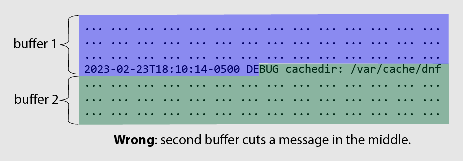
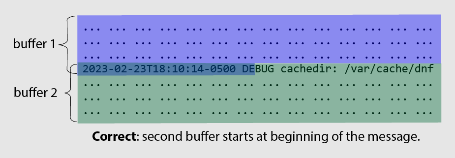

# Design objects

This page explains log-surgeon's high-level design objectives and its two styles
of API.

# Programmatic design

The parser is designed to be generated programmatically at runtime. This is
different from traditional parser generators, that output source code to be
built prior to the run of the application utilizing the parser.

This design improves the flexibility of the parser while also simplifying its
usage. Due to the nature of unstructured logs, it is rarely possible to know all
the possible ways information may be represented. Therefore, when performing
any type of analysis on the logs it is important to quickly iterate and
programmatically build up the set of patterns necessary to extract any relevant
information. Thus, users can perform any type of analysis on an assortment of
heterogeneous logs without requiring any common logging framework, or any
preprocessing on the logs.

With a traditional parser generator, performing the same tasks would require
tedious rebuilding of both the parser and application. Additionally, any small
change or addition found in newer logs would also require a full rebuild.
Therefore, the programmatic design also heavily simplifies the build process of
a user application as there is no need to install and run separate tools to
generate the parser before building it with the application. A user can simply
add or change a pattern in their source code constructing the parser (or in a
schema text file).

# API styles

This library has two API styles to parse logs:
* The *buffer* parser requires the user to perform all reading operations and
  the parser will extract logs from the provided byte buffer.
* The *reader* parser allows the parser to perform all reading operations by
  calling user provided functions, abstracting the IO source.

## [BufferParser](../src/log_surgeon/BufferParser.hpp)

The byte buffer style focuses on flexibility for the user, letting them control
all IO operations for the logs. However, this requires some care:

1. The user must ensure the buffer starts at the beginning of a log event.
   Consider the following example:
   
   * The two non-overlapping buffers split in the middle of a log event. If
     we try to simply parse the two buffers, one after another, the parser won't
     return the split log event since it doesn't buffer partially parsed content
     internally. Instead, the user must insert the partial log event from
     `buffer 1` at the start of `buffer 2` as shown in the next figure.
   
   * To do this, the user uses the `offset` (end pointer) returned from parsing
     the last complete message in `buffer 1`. Then they copy the partial message
     starting at `offset` in `buffer 1` and insert it at the start of
     `buffer 2`.
2. Note that the library detects the end of a log by finding the start of the
   next log, i.e., the next timestamp (or the end of the buffer if
   `finished_reading_input` is true). This means that even if the first buffer
   ends at the boundary of a log message, the library will not parse the last
   message in the buffer (`offset` will point to the end of the second-to-last
   log) unless `finished_reading_input` is true.
3. For good performance, the user must perform efficient IO with minimal
   copying.

In general, the requirements above lead to more code to write and maintain.

## [ReaderParser](../src/log_surgeon/ReaderParser.hpp)

A `Reader` allows the parser to handling all IO. This simplifies the user's code
and ensures efficient IO use by the parser. This requires the user to define a
single function:
* `read`: A typical read function that takes a destination byte buffer and size
  to read. The amount read must be written to a parameter and the method should
  return the appropriate `ErrorCode`. The parser will call this function using
  its internal buffer as the destination.

This interface is simple, but extendable.
* For example, if the user does not want read to block indefinitely, they can
  include timeout logic inside their provided function (for example, in the
  case of a blocking socket).

# [LogEventView and LogEvent](../src/log_surgeon/LogEvent.hpp)

The relationship between `LogEventView` and `LogEvent` is analogous to
`std::string_view` and `std::string`.
* A `LogEvent` object *owns* the underlying bytes necessary to express any
  information about the log event. Any `string_view` returned by its methods
  will reference the `LogEvent`'s internal data.
* A `LogEventView` object has weak references to the byte buffer used during
  parsing. Any `string_view` returned by its methods will reference this source
  buffer's data.
  * A `LogEventView` can create a `LogEvent` by using
    `LogEventView::deep_copy()` or a `LogEvent` constructor.

## LogEventView lifetime

A `LogEventView` remains valid if the lifetime of the parsing buffer it
references has not ended and the buffer is not mutated.
* For `BufferParser`, the user must ensure the buffer used to produce a
  `LogEventView` still contains the correct references.
* For `ReaderParser`, a `LogEventView` is safe to use until the next
  `*Parser::get*` invocation.
